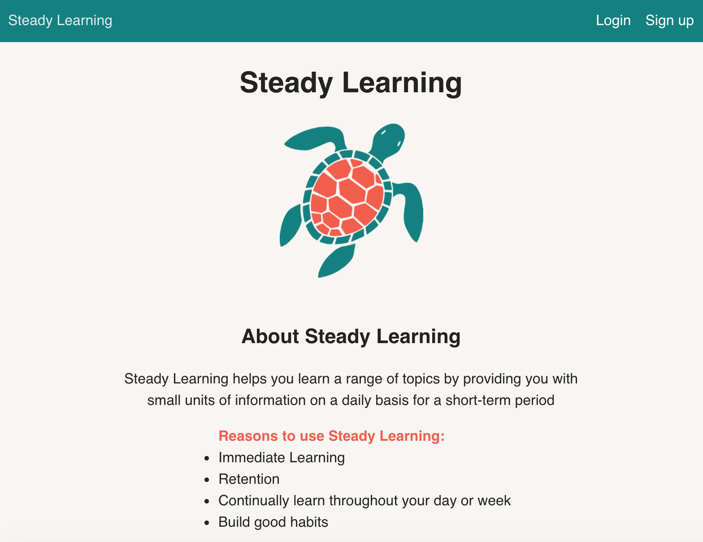
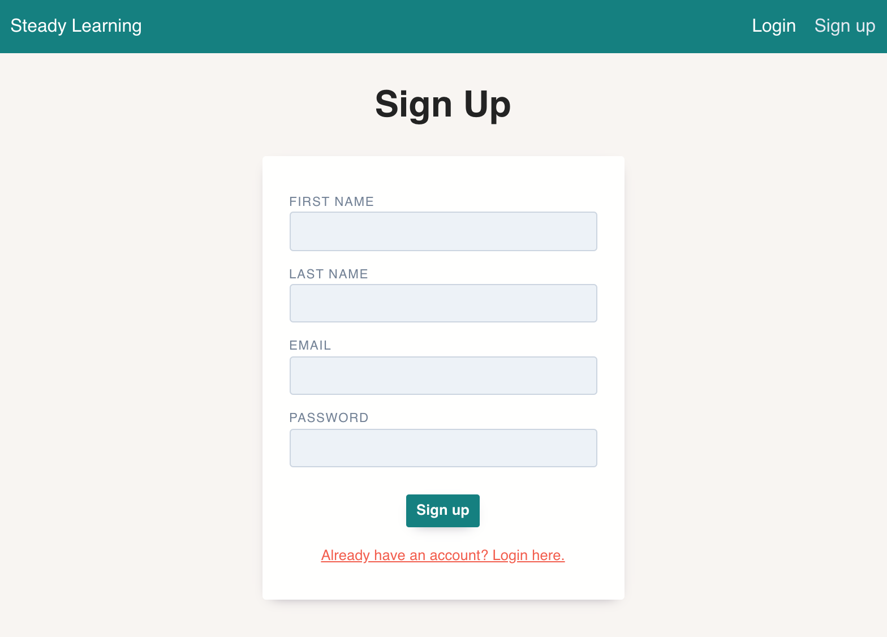
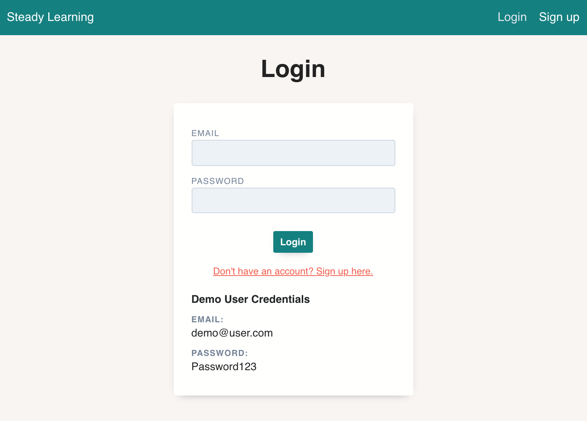
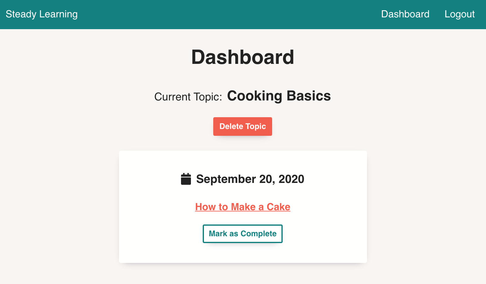
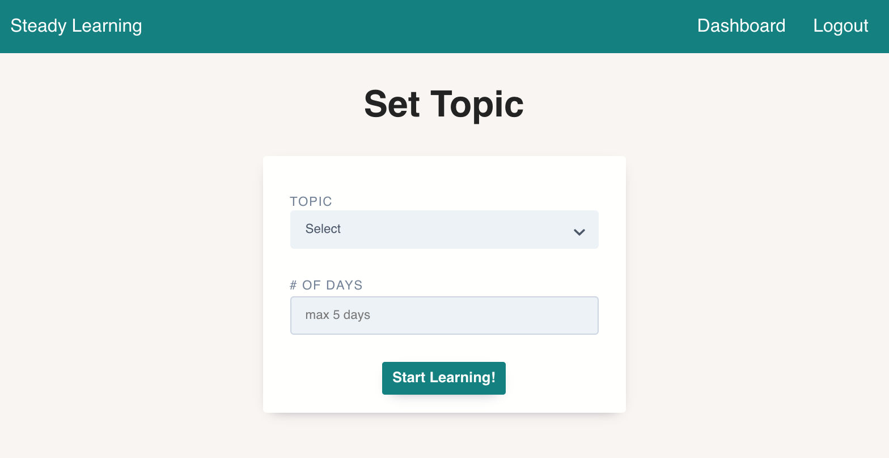

# Steady Learning

Users are provided with a new article each day about a topic that they are interested in learning about for a set number of days

## Live App
https://steady-learning.vercel.app

# API Repo
https://github.com/amyamrani/steady-learning-api

## Screenshots

Landing Page:

Sign Up Page:

Login Page:

Dashboard:

Set Topic Page:

## Technologies Used
- React
- CSS
- Node
- Express
- PostgreSQL
